# Levelup-Labs - Complete Technical Documentation

## Table of Contents
1. [Tech Stack](#tech-stack)
2. [Architecture Overview](#architecture-overview)
3. [Database Schema](#database-schema)
4. [User Flows](#user-flows)
5. [Feature Documentation](#feature-documentation)
6. [Navigation Flow](#navigation-flow)
7. [Edge Functions Workflow](#edge-functions-workflow)
8. [Authentication Flow](#authentication-flow)
9. [Points & Leaderboard System](#points--leaderboard-system)
10. [Admin Workflows](#admin-workflows)

---

## Tech Stack

### Frontend
- **Framework**: Next.js 16.1.6 (App Router, Turbopack)
- **Language**: TypeScript 5.7.3 (strict mode)
- **Styling**: Tailwind CSS 3.4
- **UI Components**: shadcn/ui (Radix UI primitives) — 40+ pre-built components
- **Fonts**: 
  - Global: Space Grotesk (secondary font)
  - Per-page gamification feel: Orbitron + Rajdhani via Google Fonts
- **Code Editor**: Custom `<CodeEditor>` component (textarea-based, no Monaco/CodeMirror dependency)
- **State Management**: React `useState` / `useEffect` hooks
- **Routing**: Next.js App Router (file-based, 19 dynamic routes)
- **Theme**: `next-themes` 0.4.6 (dark/light mode)
- **Notifications**: Sonner 1.7.1 (toast notifications)
- **HTTP Client**: `@supabase/supabase-js` 2.95.3
- **SSR Auth**: `@supabase/ssr` 0.8.0 (httpOnly cookie management)

### Backend
- **Database**: Supabase (PostgreSQL with Row Level Security)
- **Authentication**: Supabase Auth (JWT-based tokens, httpOnly cookies via @supabase/ssr)
- **Serverless Functions**: Supabase Edge Functions (Deno runtime)
- **AI**: Google Gemini API (`gemini-2.5-flash`, fallback `gemini-2.0-flash`)
- **API Keys**: Round-robin load balancing across 4 Gemini API keys
- **Storage**: Supabase Storage (avatars, thumbnails)
- **RLS**: Row Level Security policies on all tables (students see own rows, admins see context-dependent rows via migration 004)

### Development
- **Package Manager**: pnpm (lockfile: `pnpm-lock.yaml`), also compatible with npm
- **Build Tool**: Turbopack (`next dev --turbo`)
- **Linting**: ESLint (eslint-config-next)
- **Type Checking**: TypeScript strict mode
- **Version Control**: Git → GitHub → Vercel auto-deploy

---

## Architecture Overview

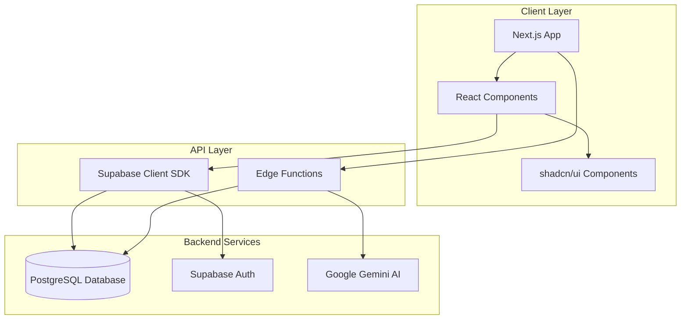

### System Architecture

```
┌─────────────────────────────────────────────────────────────┐
│                     CLIENT (Browser)                         │
│  ┌──────────────┐  ┌──────────────┐  ┌──────────────┐      │
│  │   Pages      │  │  Components  │  │     Lib      │      │
│  │  (Routes)    │  │    (UI)      │  │  (Business)  │      │
│  └──────────────┘  └──────────────┘  └──────────────┘      │
└─────────────────────────────────────────────────────────────┘
                           ↓ ↑
┌─────────────────────────────────────────────────────────────┐
│                    SUPABASE BACKEND                          │
│  ┌──────────────┐  ┌──────────────┐  ┌──────────────┐      │
│  │   Auth JWT   │  │  PostgreSQL  │  │ Edge Funcs   │      │
│  │              │  │   Database   │  │   (Deno)     │      │
│  └──────────────┘  └──────────────┘  └──────────────┘      │
└─────────────────────────────────────────────────────────────┘
                           ↓ ↑
┌─────────────────────────────────────────────────────────────┐
│                    EXTERNAL SERVICES                         │
│  ┌──────────────┐  ┌──────────────┐  ┌──────────────┐      │
│  │ Google       │  │   YouTube    │  │   Storage    │      │
│  │ Gemini AI    │  │   Embeds     │  │   (Files)    │      │
│  └──────────────┘  └──────────────┘  └──────────────┘      │
└─────────────────────────────────────────────────────────────┘
```

---

## Database Schema

### Core Tables

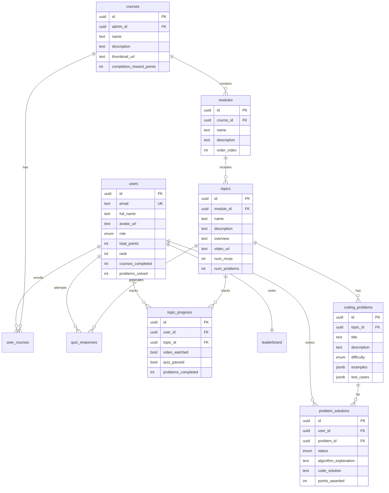

### Database Enums

- **user_role**: `'admin'` | `'user'`
- **problem_difficulty**: `'easy'` | `'medium'` | `'hard'`
- **solution_status**: `'pending'` | `'algorithm_submitted'` | `'algorithm_verified'` | `'algorithm_approved'` | `'code_submitted'` | `'code_failed'` | `'completed'` | `'failed'`

---

## User Flows

### Student Learning Flow

```mermaid
flowchart TD
    Start([Student Logs In]) --> Dashboard[Dashboard Page]
    Dashboard --> BrowseCourses[Browse Courses]
    BrowseCourses --> EnrollCourse[Enroll in Course]
    EnrollCourse --> MyCourses[My Courses Page]
    MyCourses --> SelectTopic[Select Topic]
    
    SelectTopic --> TopicLanding[Topic Landing Page]
    TopicLanding --> CheckProgress{Check Progress}
    
    CheckProgress -->|Step 1| WatchVideo[Watch Video]
    WatchVideo --> MarkWatched[Mark as Watched]
    MarkWatched --> TopicOverview{View Topic Overview?}
    TopicOverview -->|Yes| EnhancedOverview[AI-Enhanced Overview]
    TopicOverview -->|No| TakeQuiz
    EnhancedOverview --> TakeQuiz[Take Quiz]
    
    CheckProgress -->|Step 2| TakeQuiz
    TakeQuiz --> GenerateQuiz[Generate AI Quiz]
    GenerateQuiz --> AnswerQuestions[Answer 5 MCQs]
    AnswerQuestions --> SubmitQuiz[Submit Quiz]
    SubmitQuiz --> CheckScore{Score >= 70%?}
    CheckScore -->|No| RetryQuiz[Retry Quiz]
    RetryQuiz --> GenerateQuiz
    CheckScore -->|Yes| QuizPassed[Quiz Passed]
    QuizPassed --> UpdateProgress1[Update topic_progress]
    
    CheckProgress -->|Step 3| SolveProblems
    UpdateProgress1 --> SolveProblems[Solve Problems Page]
    SolveProblems --> SelectProblem[Select Problem]
    SelectProblem --> ExplainPage[Explain Algorithm Page]
    
    ExplainPage --> WriteAlgorithm[Write Algorithm Explanation]
    WriteAlgorithm --> SubmitAlgorithm[Submit to AI Verification]
    SubmitAlgorithm --> VerifyAlgorithm{AI Verifies}
    VerifyAlgorithm -->|Rejected| ReviseAlgorithm[Revise Explanation]
    ReviseAlgorithm --> WriteAlgorithm
    VerifyAlgorithm -->|Approved| GoToCode[Go to Code Page]
    
    GoToCode --> CodePage[Code Editor Page]
    CodePage --> WriteCode[Write Code Solution]
    WriteCode --> RunCode[Run Test Cases]
    RunCode --> CheckTests{All Tests Pass?}
    CheckTests -->|No| FixCode[Fix Code]
    FixCode --> WriteCode
    CheckTests -->|Yes| SubmitCode[Submit Code]
    SubmitCode --> AwardPoints[Award Points]
    AwardPoints --> UpdateLeaderboard[Update Leaderboard]
    UpdateLeaderboard --> UpdateProgress2[Update topic_progress]
    
    UpdateProgress2 --> CheckAllProblems{All Problems Solved?}
    CheckAllProblems -->|No| SelectProblem
    CheckAllProblems -->|Yes| TopicComplete[Topic Completed!]
    
    TopicComplete --> ViewLeaderboard[View Leaderboard]
    ViewLeaderboard --> CheckRank[Check Your Rank]
    CheckRank --> NextTopic[Continue to Next Topic]
    NextTopic --> MyCourses
```

### Admin Course Creation Flow

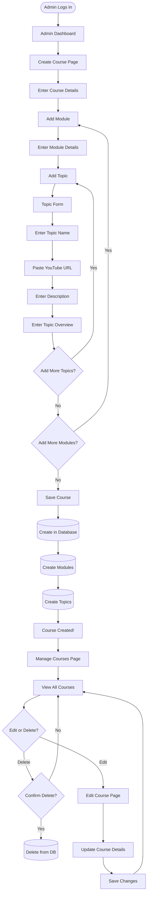

---

## Feature Documentation

### 1. Authentication System

**Flow**:
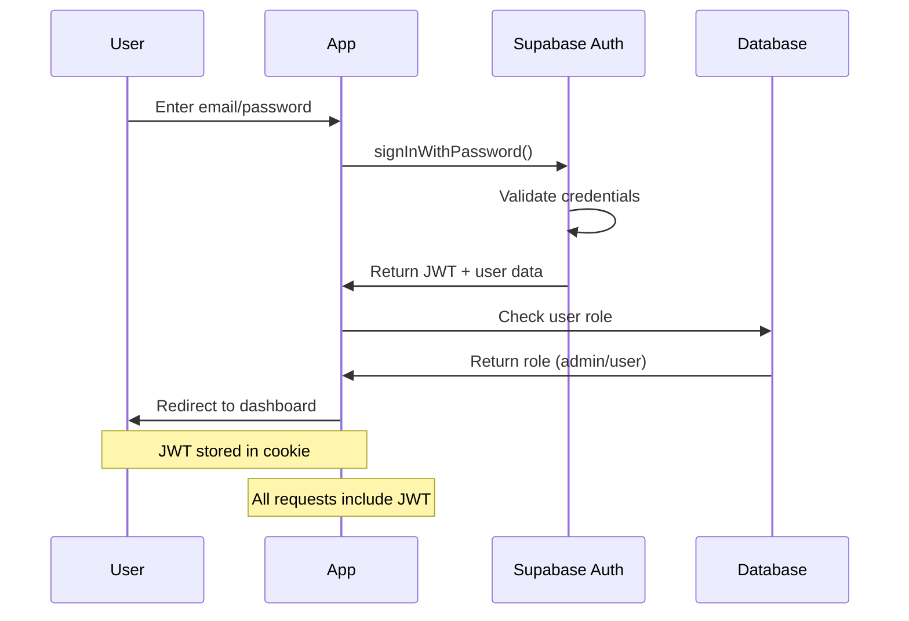

**Implementation**:
- Location: `lib/auth.ts`
- Functions:
  - `signUp()` - Create new user account
  - `signIn()` - Login with email/password
  - `signOut()` - Logout and clear session
  - `getCurrentUser()` - Get authenticated user
  - `resetPassword()` - Password reset flow

**Pages**:
- `/auth/login` - Login form
- `/auth/signup` - Registration form
- `/auth/forgot-password` - Password reset request
- `/auth/reset-password` - Set new password

---

### 2. Course Management

**Admin Course Creation**:

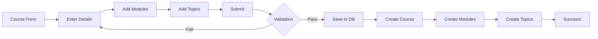

**Database Operations**:
1. Create course record in `courses` table
2. For each module:
   - Create record in `modules` table
   - Link to course via `course_id`
3. For each topic:
   - Create record in `topics` table
   - Link to module via `module_id`
   - Store YouTube URL, description, overview

**Enrollment Flow**:
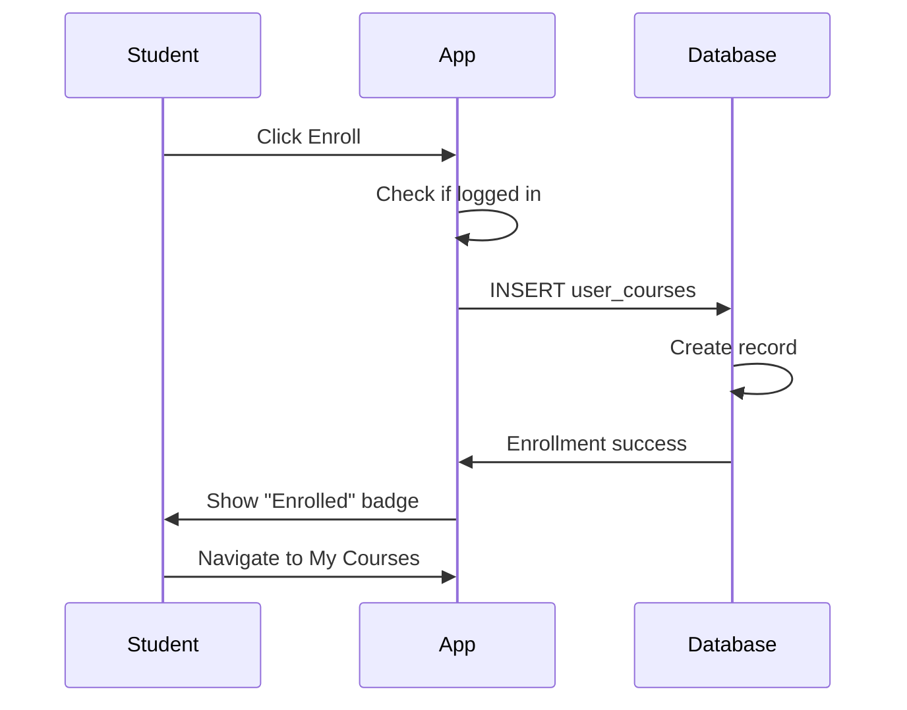

---

### 3. Topic Learning Flow (3-Step Process)

#### Step 1: Watch Video

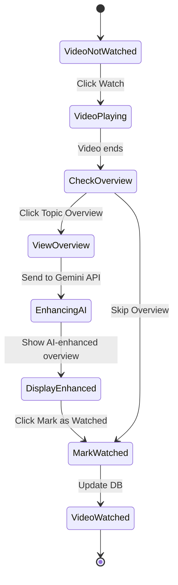

**Implementation**:
- Page: `/topic/[id]/watch`
- Component: YouTube iframe embed
- Action: `markVideoAsWatched()` → Updates `topic_progress.video_watched = true`
- Enhanced Overview: Calls `enhanceOverview` Edge Function → Gemini AI enhances the admin-provided overview

#### Step 2: Take Quiz

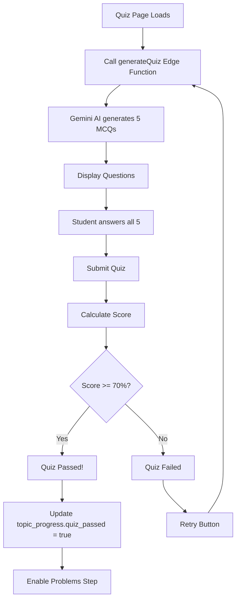

**Edge Function**: `generateQuiz`
- Input: `topicId`, `topicName`, `numQuestions`, `topicOverview`
- Process:
  1. Authenticate user
  2. Call Gemini AI with prompt including topic overview
  3. Parse JSON response
  4. Return array of questions with options and correct answers
- Output: `{ questions: [{question, options, correctAnswer}] }`

**Database Operations**:
- Insert into `quiz_responses` table
- Update `topic_progress.quiz_passed = true` if score >= 70%

#### Step 3: Solve Problems

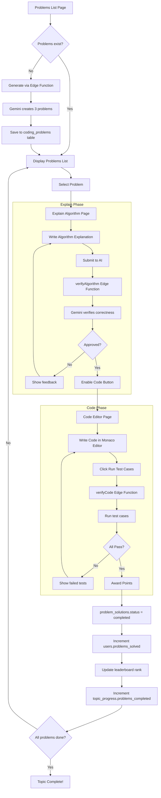

**Problem Generation**:
- Edge Function: `generateProblems`
- Input: `topicId`, `topicName`, `numProblems`, `topicOverview`
- Output: Array of problems with title, description, examples, test cases
- Saved to `coding_problems` table

**Algorithm Verification**:
- Edge Function: `verifyAlgorithm`
- Input: Problem description + user's algorithm explanation
- AI checks: correctness, completeness, clarity
- Output: `{ approved: boolean, feedback: string }`

**Code Verification**:
- Edge Function: `verifyCode`
- Input: Problem test cases + user's code
- Process:
  1. Run code against all test cases
  2. Check outputs match expected
  3. Award points based on difficulty
  4. Update `problem_solutions` table
  5. Call `add_points_to_user` RPC function
  6. Update leaderboard

---

### 4. Review Mode (Solved Problems)

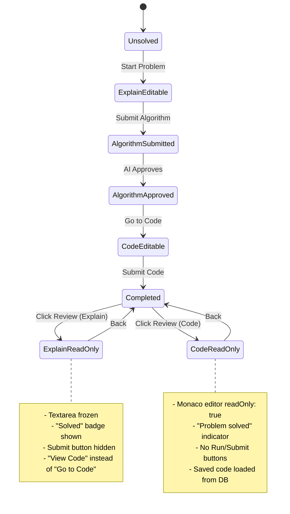

**Implementation**:
- Explain page checks `problem.status === 'completed'`
- If solved:
  - Load saved `algorithm_explanation` from DB
  - Show read-only textarea
  - Display "Solved ✓" badge
  - Hide submit button
  - Show "View Code" instead of "Go to Code"
- Code page checks problem status
- If solved:
  - Load saved `code_solution` from DB
  - Set `CodeEditor` prop `readOnly={true}`
  - Show "Problem solved — code is read-only" message
  - Hide run/submit buttons

---

### 5. Points & Leaderboard System

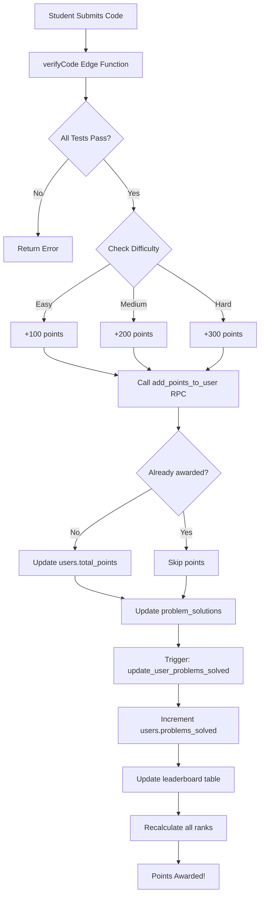

**Points Breakdown**:
- Easy problem: **100 points**
- Medium problem: **200 points**
- Hard problem: **300 points**

**Database Updates**:
1. `users.total_points` += points
2. `users.problems_solved` += 1
3. `problem_solutions.status` = 'completed'
4. `problem_solutions.points_awarded` = points
5. `leaderboard.total_points` updated
6. `leaderboard.rank` recalculated for all users

**Idempotency**:
- Edge Function checks if `points_awarded > 0` BEFORE calling RPC
- RPC function also checks to prevent double-awarding
- Fallback: Direct `users` table update if RPC fails

**Rank Calculation**:
- Ordered by `total_points DESC`
- Trigger function `update_leaderboard_ranks` runs on insert/update
- Ranks are 1-indexed (1st place, 2nd place, etc.)

---

### 6. Admin Filtering

**Leaderboard Admin Exclusion**:
```sql
-- All leaderboard queries filter out admin users
SELECT * FROM users
WHERE role != 'admin'
ORDER BY total_points DESC
```

**Implementation**:
- `lib/leaderboard.ts`:
  - `getTopLeaderboard()` → `.neq('role', 'admin')`
  - `searchLeaderboard()` → `.neq('role', 'admin')`
- Admin users don't appear in:
  - Leaderboard page
  - Dashboard top 5 leaderboard
  - Search results

---

## Navigation Flow

### Navbar Links (Authenticated)

**Student Navbar**
- `/dashboard` (HOME)
- `/courses` (GATES)
- `/my-courses` (MY QUESTS)
- `/practice` (PRACTICE)
- `/leaderboard` (RANKINGS)

**Admin Navbar**
- `/dashboard` (HOME)
- `/admin/dashboard` (ADMIN)
- `/admin/create-course` (CREATE)
- `/admin/courses` (CONSOLE)
- `/courses` (GATES)
- `/practice` (PRACTICE)
- `/leaderboard` (RANKINGS)

### Public Routes (No Auth Required)
```
/ (Home Page)
├── Features, Hero, CTA
└── → /auth/login or /auth/signup

/auth/login → /dashboard (after login)
/auth/signup → /dashboard (after signup)
/auth/forgot-password → Email sent
/auth/reset-password → /auth/login
```

### Student Routes (Auth Required)
```
/dashboard
├── Stats cards (points, problems, courses)
├── Continue Learning section → /my-courses
├── Top 5 Leaderboard → /leaderboard
└── Recent courses

/courses (Browse all courses)
└── → /my-courses (after enrollment)

/my-courses (Enrolled courses with progress)
└── Click topic → /topic/[id] (landing page)

/topic/[id] (Topic landing page - progress tracker)
├── → /topic/[id]/watch (Step 1: Video)
├── → /topic/[id]/quiz (Step 2: Quiz)
└── → /topic/[id]/problems (Step 3: Problems list)

/topic/[id]/problems
└── Click problem → /topic/[id]/problems/[problemId]/explain

/topic/[id]/problems/[problemId]/explain
└── Algorithm approved → /topic/[id]/problems/[problemId]/code

/topic/[id]/problems/[problemId]/code
└── Code submitted → Back to /topic/[id]/problems

/leaderboard
├── View all rankings
├── Search by name/rank
└── View own rank

/practice
└── Browse all problems across topics

/profile
└── /profile/edit (Update profile)
```

### Admin Routes (Admin Role Required)
```
/admin/dashboard
├── Course management cards
├── Create new course → /admin/create-course
└── Manage courses → /admin/courses

/admin/create-course
└── Submit → /admin/dashboard

/admin/courses
├── View all courses table
├── Edit course → /admin/courses/[id]/edit
└── Delete course (with confirmation)

/admin/courses/[id]/edit
└── Save changes → /admin/courses
```

### Route Protection
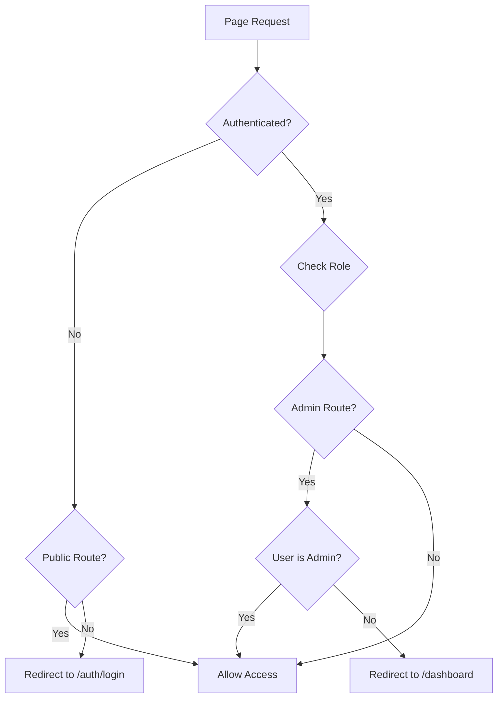

---

## Edge Functions Workflow

### 1. generateQuiz

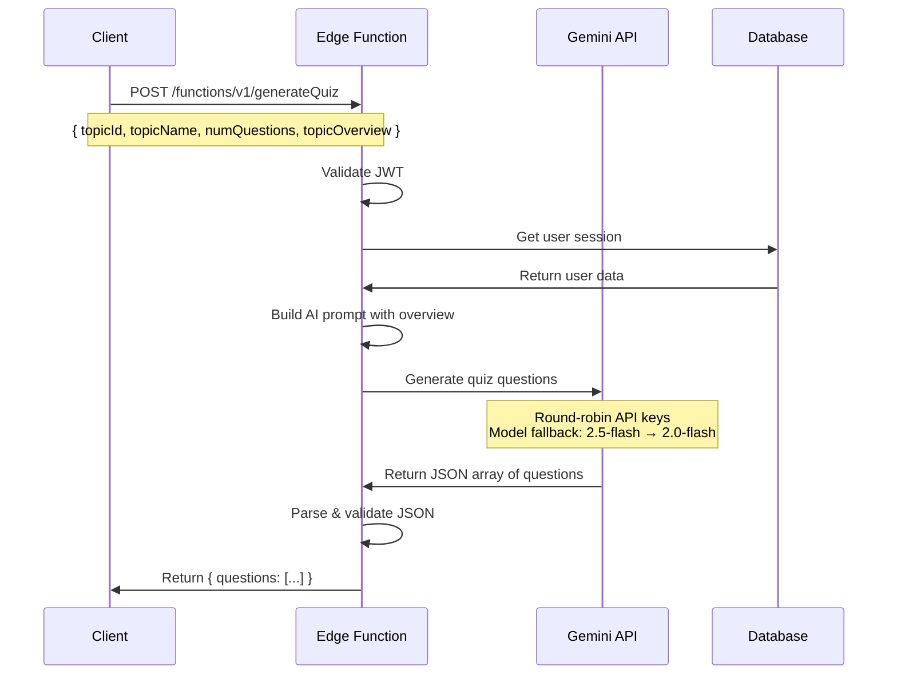

**Key Features**:
- 4 API keys in round-robin rotation
- Model fallback: gemini-2.5-flash → gemini-2.0-flash
- Topic overview included in prompt for context
- Returns array of MCQs with options and correct answer index

### 2. generateProblems

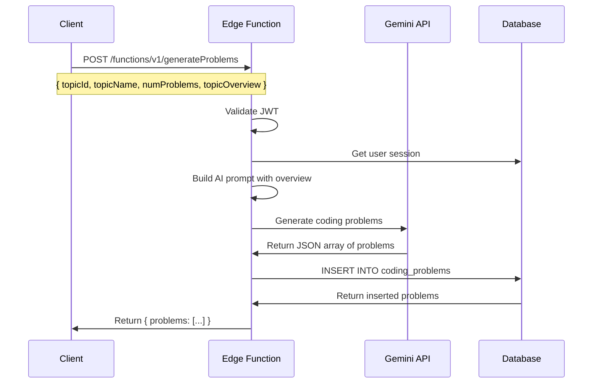

**Generated Problem Structure**:
```json
{
  "title": "Problem Title",
  "description": "Detailed description with constraints",
  "difficulty": "easy|medium|hard",
  "examples": [
    {
      "input": "example input",
      "output": "example output",
      "explanation": "why this output"
    }
  ],
  "testCases": [
    {
      "input": "test input",
      "expectedOutput": "expected output"
    }
  ]
}
```

### 3. verifyAlgorithm

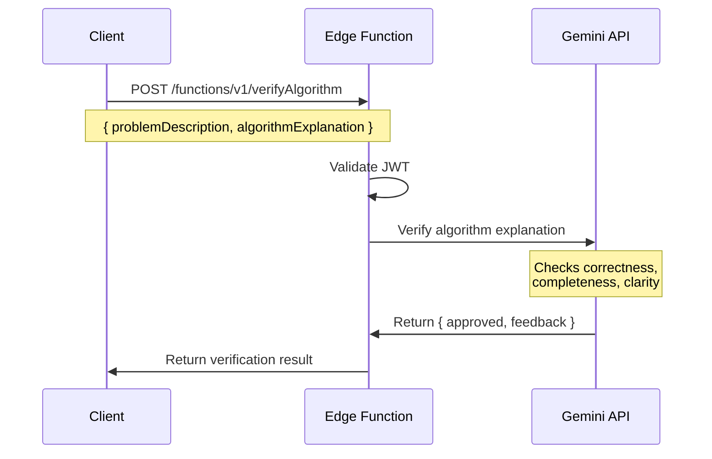

**AI Evaluation Criteria**:
- Correctness: Does the algorithm solve the problem?
- Completeness: Are all edge cases considered?
- Clarity: Is the explanation clear and understandable?
- Efficiency: Is the approach reasonably efficient?

### 4. verifyCode

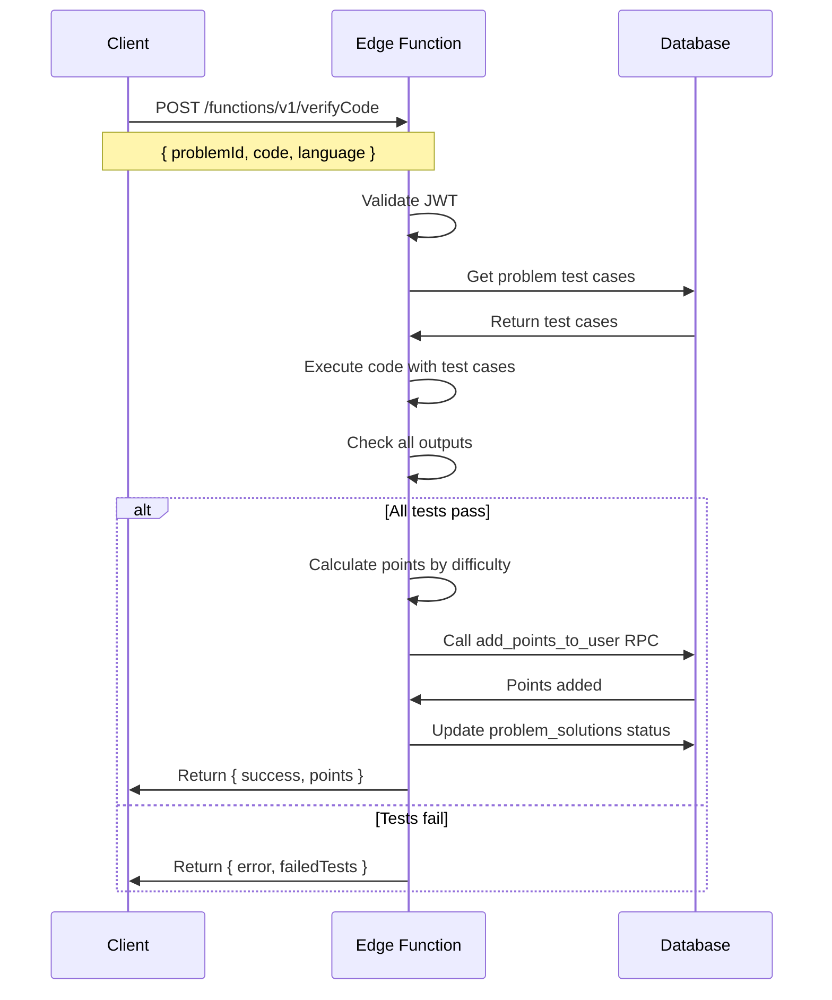

**Points Award Flow**:
1. Check if `problem_solutions.points_awarded > 0` (client-side idempotency)
2. Call `add_points_to_user(user_id, points)` RPC BEFORE updating solution
3. RPC checks if points already awarded (DB idempotency)
4. Update `users.total_points`
5. Update `problem_solutions.status = 'completed'`
6. Trigger `update_user_problems_solved` increments counter
7. Update leaderboard ranks

### 5. enhanceOverview

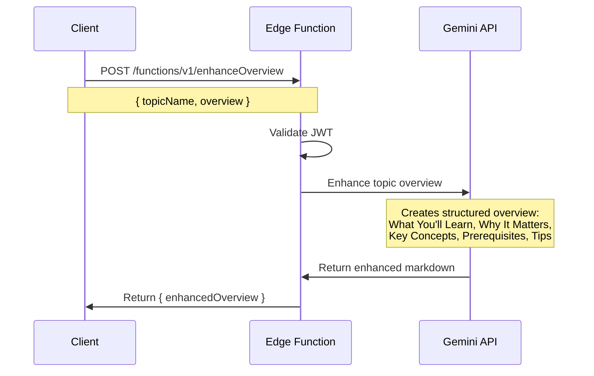

**Enhanced Overview Structure**:
- **What You'll Learn** — Key concepts summary
- **Why It Matters** — Real-world relevance
- **Key Concepts** — Bullet points of main technical concepts
- **Prerequisites** — What student should already know
- **Learning Tips** — Quick tips for mastering the topic

---

## Authentication Flow

### Signup Flow
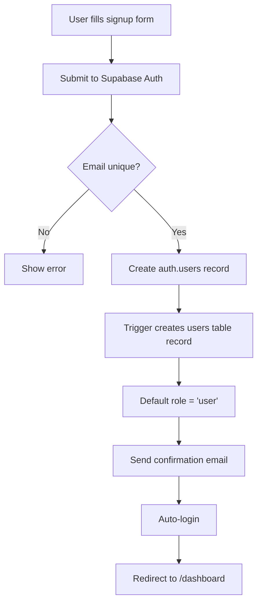

### Login Flow
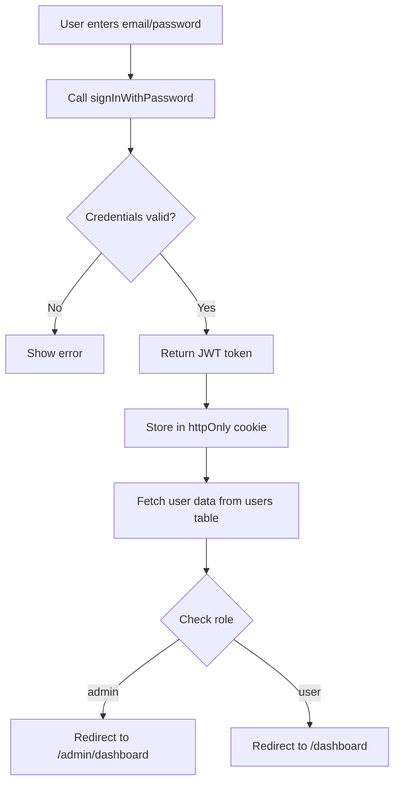

### Password Reset Flow
```mermaid
flowchart TD
    A[User clicks Forgot Password] --> B[Enter email]
    B --> C[Submit to Supabase Auth]
    C --> D[Send reset email with token]
    D --> E[User clicks email link]
    E --> F[Redirect to /auth/reset-password?token=xxx]
    F --> G[Enter new password]
    G --> H[Submit with token]
    H --> I[Update password in auth.users]
    I --> J[Redirect to /auth/login]
```

### Session Management
```mermaid
flowchart TD
    A[Every page load] --> B{Session exists?}
    B -->|No| C{Protected route?}
    C -->|Yes| D[Redirect to /auth/login]
    C -->|No| E[Allow access]
    B -->|Yes| F[Refresh JWT token]
    F --> G{Token valid?}
    G -->|No| D
    G -->|Yes| H[Load user data]
    H --> I{Check route permissions}
    I -->|Admin route + user role| J[Redirect to /dashboard]
    I -->|Allowed| K[Render page]
```

---

## Points & Leaderboard System

### Points Award Process

```mermaid
flowchart TD
    A[Student submits code] --> B[verifyCode Edge Function]
    B --> C{All tests pass?}
    C -->|No| D[Return error]
    C -->|Yes| E{Check difficulty}
    
    E -->|Easy| F[100 points]
    E -->|Medium| G[200 points]
    E -->|Hard| H[300 points]
    
    F --> I{Client-side check:<br/>points_awarded > 0?}
    G --> I
    H --> I
    
    I -->|Yes| J[Skip - Already awarded]
    I -->|No| K[Call add_points_to_user RPC]
    
    K --> L{DB check:<br/>points already awarded?}
    L -->|Yes| M[Skip]
    L -->|No| N[Update users.total_points]
    
    N --> O[Update problem_solutions status]
    O --> P[Trigger: update_user_problems_solved]
    P --> Q[Increment users.problems_solved]
    Q --> R[Update leaderboard.total_points]
    R --> S[Recalculate leaderboard.rank]
    S --> T[Return success]
    
    J --> O
    M --> O
```

### Leaderboard Rank Calculation

```mermaid
flowchart TD
    A[Points updated] --> B[Trigger: update_leaderboard_ranks]
    B --> C[Query all users ORDER BY total_points DESC]
    C --> D[Assign ranks 1, 2, 3...]
    D --> E[Update leaderboard.rank for all]
    E --> F[Users.rank = leaderboard.rank]
    F --> G[Leaderboard updated!]
```

**Rank Display**:
- Leaderboard page shows all users (except admins)
- Dashboard shows top 5
- Each user can see their own rank
- Podium display for top 3 (gold, silver, bronze)

---

## Admin Workflows

### Course Creation Workflow

```mermaid
flowchart TD
    Start[Admin Dashboard] --> Create[Click Create Course]
    Create --> Form[Course Creation Form]
    
    Form --> CourseSection[Course Details Section]
    CourseSection --> CourseName[Enter name*]
    CourseName --> CourseDesc[Enter description*]
    CourseDesc --> Thumbnail[Enter thumbnail URL]
    Thumbnail --> Points[Set completion reward points]
    
    Points --> ModuleSection[Modules Section]
    ModuleSection --> AddModule[Click Add Module]
    AddModule --> ModuleName[Enter module name*]
    ModuleName --> ModuleDesc[Enter module description]
    ModuleDesc --> TopicSection[Topics Section]
    
    TopicSection --> AddTopic[Click Add Topic]
    AddTopic --> TopicName[Enter topic name*]
    TopicName --> VideoURL[Enter YouTube URL*]
    VideoURL --> TopicDesc[Enter topic description]
    TopicDesc --> TopicOverview[Enter topic overview]
    
    TopicOverview --> MoreTopics{Add more topics?}
    MoreTopics -->|Yes| AddTopic
    MoreTopics -->|No| MoreModules{Add more modules?}
    
    MoreModules -->|Yes| AddModule
    MoreModules -->|No| Validate{Validation}
    
    Validate -->|Fail| ValidationError[Show errors]
    ValidationError --> Form
    
    Validate -->|Pass| SaveCourse[Save to Database]
    SaveCourse --> CreateCourse[INSERT INTO courses]
    CreateCourse --> CreateModules[INSERT INTO modules]
    CreateModules --> CreateTopics[INSERT INTO topics]
    CreateTopics --> Success[Success! Redirect]
    Success --> ManageCourses[Admin Courses Page]
```

### Course Management

```mermaid
stateDiagram-v2
    [*] --> ManageCourses
    ManageCourses --> ViewCourses: Load courses
    ViewCourses --> FilterSearch: Search/Filter
    FilterSearch --> ViewCourses: Apply filters
    
    ViewCourses --> EditCourse: Click Edit
    EditCourse --> EditForm: Load course data
    EditForm --> SaveChanges: Submit
    SaveChanges --> ViewCourses: Update successful
    
    ViewCourses --> DeleteCourse: Click Delete
    DeleteCourse --> ConfirmDelete: Show dialog
    ConfirmDelete --> ViewCourses: Confirm
    ConfirmDelete --> ViewCourses: Cancel
    
    ViewCourses --> [*]
```

---

## Complete Learning Journey Diagram

```mermaid
flowchart TB
    Start([Student Signup/Login]) --> Dashboard[📊 Dashboard]
    
    Dashboard --> Browse[🔍 Browse Courses]
    Browse --> CourseDetail[📚 Course Detail Page]
    CourseDetail --> Enroll{Enroll}
    Enroll --> MyCourses[📖 My Courses]
    
    MyCourses --> Topic1[📝 Topic 1]
    
    subgraph "Topic Learning Journey"
        Topic1 --> Video[🎥 Watch Video]
        Video --> Overview{View Overview?}
        Overview -->|Yes| AIOverview[✨ AI-Enhanced Overview]
        Overview -->|No| Quiz
        AIOverview --> Quiz[❓ Take Quiz 5 MCQs]
        Quiz --> QuizScore{Score >= 70%?}
        QuizScore -->|No| RetryQuiz[🔄 Retry]
        RetryQuiz --> Quiz
        QuizScore -->|Yes| Problems[💻 Solve Problems]
        
        Problems --> Problem1[Problem 1: Easy]
        Problem1 --> ExplainAlgo[📝 Explain Algorithm]
        ExplainAlgo --> AIVerify1[🤖 AI Verifies]
        AIVerify1 --> AlgoApproved{Approved?}
        AlgoApproved -->|No| ReviseAlgo[✏️ Revise]
        ReviseAlgo --> ExplainAlgo
        AlgoApproved -->|Yes| WriteCode[💻 Write Code]
        WriteCode --> RunTests[▶️ Run Tests]
        RunTests --> TestsPass{All Pass?}
        TestsPass -->|No| FixCode[🔧 Fix Code]
        FixCode --> WriteCode
        TestsPass -->|Yes| Points1[+100 points]
        
        Points1 --> Problem2[Problem 2: Medium]
        Problem2 --> Points2[+200 points]
        Points2 --> Problem3[Problem 3: Hard]
        Problem3 --> Points3[+300 points]
    end
    
    Points3 --> TopicComplete[✅ Topic Complete!]
    TopicComplete --> UpdateLeaderboard[🏆 Update Leaderboard]
    UpdateLeaderboard --> NextTopic{More topics?}
    NextTopic -->|Yes| Topic2[📝 Next Topic]
    Topic2 --> Video
    NextTopic -->|No| CourseComplete[🎉 Course Complete!]
    
    CourseComplete --> Certificate[🏅 Certificate + Bonus Points]
    Certificate --> ViewLeaderboard[🏆 View Leaderboard]
    ViewLeaderboard --> CheckRank[👑 Check Your Rank]
    CheckRank --> Practice[💪 Practice More]
    Practice --> Browse
    
    Dashboard --> Leaderboard[🏆 Leaderboard]
    Leaderboard --> Compete[🎯 Compete with others]
    Compete --> Practice
    
    style Start fill:#4ade80
    style Dashboard fill:#60a5fa
    style CourseComplete fill:#f59e0b
    style Certificate fill:#fbbf24
    style ViewLeaderboard fill:#a855f7
    style TopicComplete fill:#10b981
```

---

## Key Features Summary

### For Students
1. **Gamified Learning**: Points, leaderboard, ranks
2. **AI-Powered Content**: Quiz generation, problem generation, algorithm verification
3. **Progressive Learning**: Video → Quiz → Problems (3-step flow)
4. **Instant Feedback**: Real-time code testing, AI verification
5. **Enhanced Overviews**: Gemini-powered topic summaries
6. **Progress Tracking**: Per-topic and per-course progress
7. **Review Mode**: Revisit solved problems (read-only)
8. **Competitive Element**: Leaderboard with rankings

### For Admins
1. **Course Management**: Create, edit, delete courses
2. **Structured Content**: Modules → Topics hierarchy
3. **YouTube Integration**: Embed videos directly
4. **Topic Overviews**: Enhanced by AI for students
5. **Auto-Generated Content**: AI creates quizzes and problems
6. **Analytics Dashboard**: View course statistics

### Technical Features
1. **Responsive Design**: Works on all devices
2. **Dark/Light Mode**: Theme switching
3. **Type-Safe**: Full TypeScript coverage
4. **Optimistic UI**: Instant feedback for actions
5. **Error Handling**: Graceful error messages
6. **Security**: Row Level Security (RLS) on all tables
7. **Performance**: Turbopack, code splitting, lazy loading
8. **SEO**: Next.js metadata, semantic HTML

---

## Environment Variables

```env
# Supabase
NEXT_PUBLIC_SUPABASE_URL=https://xxx.supabase.co
NEXT_PUBLIC_SUPABASE_ANON_KEY=xxx

# Gemini API Keys (4 keys for round-robin, stored in Supabase secrets)
GEMINI_API_KEY_1=xxx
GEMINI_API_KEY_2=xxx
GEMINI_API_KEY_3=xxx
GEMINI_API_KEY_4=xxx
```

---

## Deployment

### Frontend (Vercel)
1. Connect GitHub repository
2. Set environment variables
3. Deploy from main branch
4. Automatic deployments on push

### Backend (Supabase)
1. Database: Already hosted on Supabase
2. Edge Functions: Deploy with:
   ```bash
   npx supabase functions deploy generateQuiz --no-verify-jwt
   npx supabase functions deploy generateProblems --no-verify-jwt
   npx supabase functions deploy verifyAlgorithm --no-verify-jwt
   npx supabase functions deploy verifyCode --no-verify-jwt
   npx supabase functions deploy enhanceOverview --no-verify-jwt
   ```
3. Set Gemini API keys as Supabase secrets

---

## Admin Login Credentials

**Email**: `admin@levelup-labs.com`  
**Password**: `admin123`

---

**Document Version**: 1.0  
**Last Updated**: February 15, 2026  
**Project**: Levelup-Labs - AI-Powered Gamified Learning Platform
